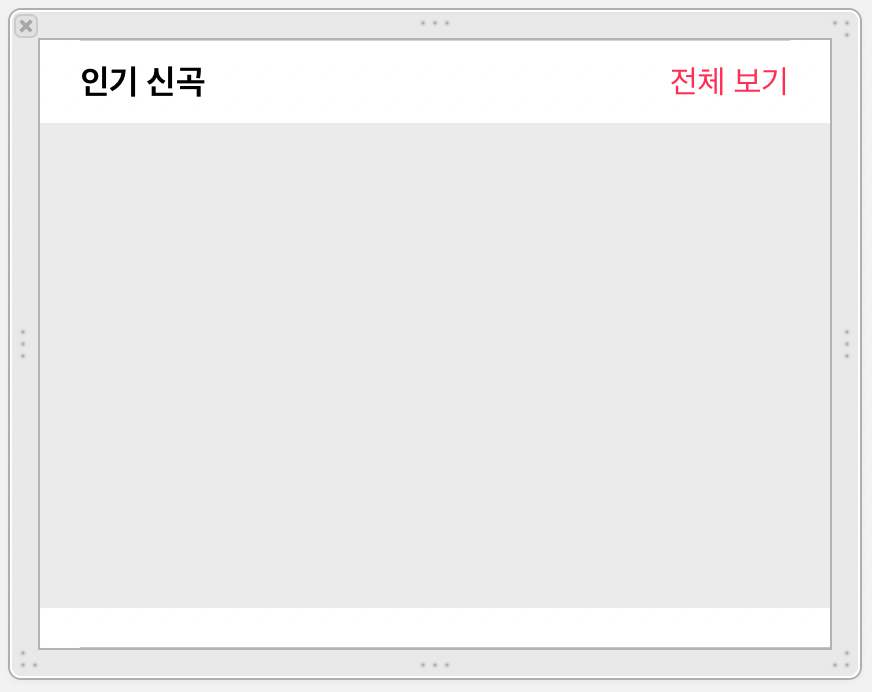
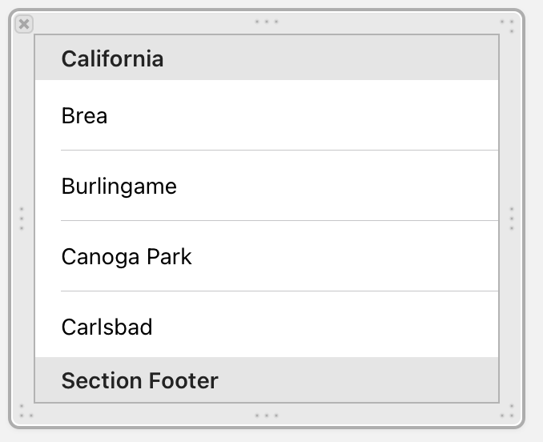
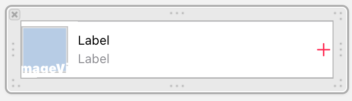

# AppleMusic

## 최종 결과물 ☺︎

  

## 구현한 기능
1. 인기신곡 - CollectionView 안에 TableView로 구성  
    
큰 TableView 안에 TableView Cell인 1번째 사진이 있고, 그 안에 CollectionView인 2번째 사진, 그 안에 3번째 사진이 들어가도록 만들어주었다.
    - 3번째 사진에 이렇게 데이터를 묶어주어 2번째 사진의 테이블에서 테이블 뷰 형태로 그려준다.
    ```swift
    func setCell(recomSong: RecomSong){
        AlbumImageView.image = UIImage(named: recomSong.imageName)
        SongLabel.text = recomSong.songLabelName
        SingerLabel.text = recomSong.songLabelName
    }
    ```
    첫번째 사진과 2번째 사진의 데이터를 첫번째 사진 부분에서 연결한 후 그려주는 형태이다.
    
    어려우니 더 공부해야겠다링..🥲


2. NavigationBar / TabBar 블러 효과  
네비게이션 바와 탭 바에 블러 효과가 어떤 코드로도 적용이 안되어 마지막까지 고민했었는데 해결했다!!!

    - `StoryBoard`   
스토리보드의 인스펙터를 보면 `Translucent`와 `Opaque`가 적용되어 있는 것을 확인 할 수 있다. 이것은 투명도를 나타내는데 이것이 적용되어 있다면 네비게이션 바와 탭 바의 기본 값이 이미 투명한 블러 효과가 적용된 상태라는 것이다. 하지만 나의 시뮬레이터에는 적용이 되지 않았고 이유는 스토리보드를 통해 확인 할 수 있었다.   
나는 테이블 뷰를 safe area 안에서만 움직일 수 있도록 했기 때문에 아무리 코드를 입력해도 safe area 밖에 존재하는 네비게이션 바와 탭바에는 적용이 될 수 없었던 것이다.   
해당 테이블 뷰를 `super view`로 맞춰주니 원하는 결과를 얻을 수 있었다.  

    - `코드`  
이번 일로 blur effect 관련하여 많이 찾아보았고, 코드로도 간단히 구현 할 수 있다는 것을 알았다.
        ```swift
        self.navigationController?.navigationBar.isTranslucent = true
        self.navigationController?.view.backgroundColor = .clear
        self.navigationController?.navigationBar.setBackgroundImage(UIImage(), for: .default)
        self.navigationController?.navigationBar.shadowImage = UIImage()
        ```
        탭바도 같은 방법으로 구현하면 된다.
        ```swift
        self.tabBarController?.tabBar.isTranslucent = true
        self.tabBarController?.view.backgroundColor = .clear
        ```
 


 
