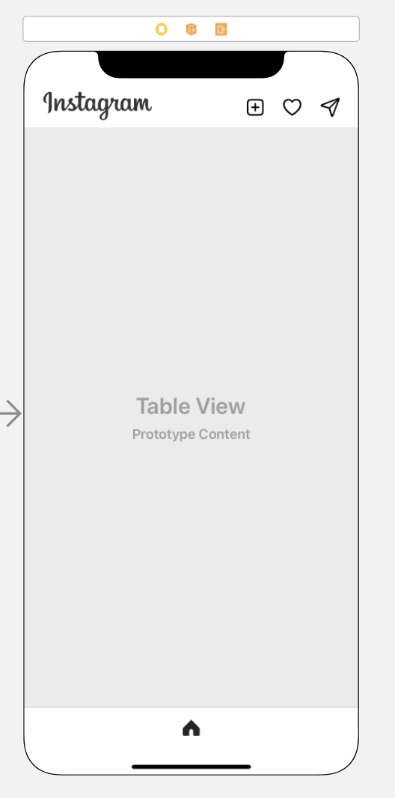
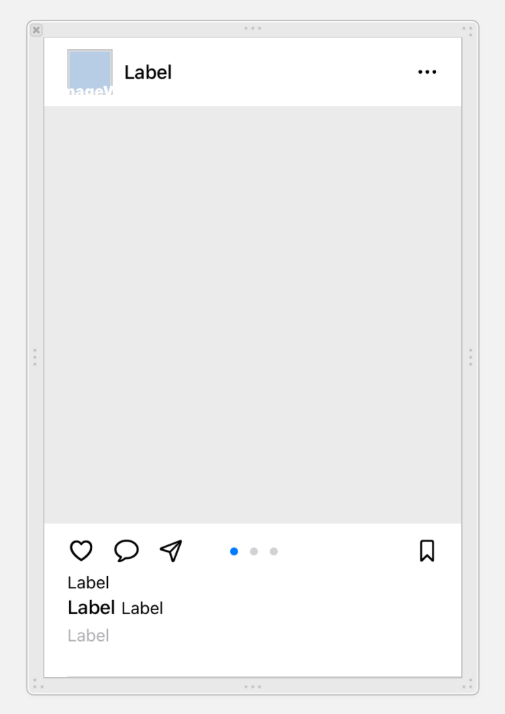
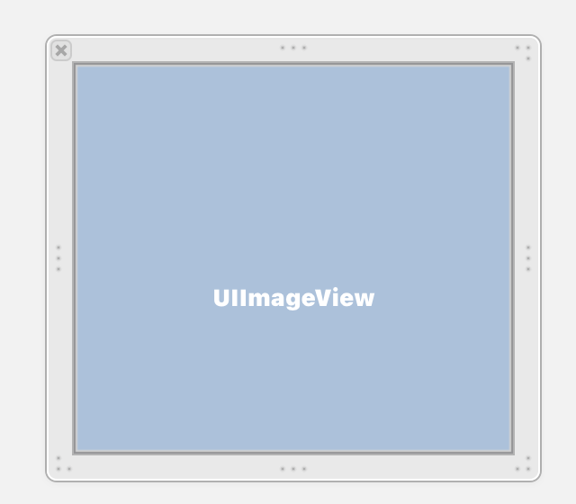

# Instagram

## 중간 점검 ☺︎


## 구현한 기능
1. 애플뮤직과 동일한 틀로 테이블 뷰 → 컬렉션 뷰 구성

  

이런식으로 큰 tableview 안에 tableview cell을 xib로 그려주고, 그 안에 들어갈 콜렉션 뷰에 collectionview xib로 구성했다.

2. 짜잘한 액티브 효과
    - 사진과 pageControl 연결
        ```swift
        // ImageView
        func setCell(post: Rec){
        imageView.image = UIImage(named: post.RecImage)
        }

        // PageControl 초기 Layout 설정
        func pageControlInitLayout() {
        pageControl.numberOfPages = post.count
        pageControl.currentPageIndicatorTintColor = .systemBlue
        }
        ```
        위의 설정을 다 했다면, 이미지뷰와 페이지 컨트롤러를 연결해주면 된다. 
        ```swift
        // PageControl과 ImageView 연결
        // 스크롤 한 후 움직임이 점차 줄어들 때 호출
        extension FriendsTVCell {
        func scrollViewDidEndDecelerating(_ scrollView: UIScrollView) {
        pageControl.currentPage =
            Int(scrollView.contentOffset.x)/Int(scrollView.frame.width) 
            }
        }
        ```
        여기서 ScrollView의 ContentsOffset과 frame 상의 너비를 비교하여 현재 Page를 구할 수 있다 !!!

    - 하트, 북마크 눌렀을 때 효과
        ```swift
        // 하트 상태변화
        @IBAction func goodAction(_ sender: UIButton) {
        if sender.isSelected == false {
            sender.isSelected = true
            likeButton.tintColor = .systemPink
        }else{
            sender.isSelected = false
            likeButton.tintColor = .black
            }
        }
        ```
        북마크도 같은 형태로 해줄 수 있다.

    - 스토리 부분 index == 0 번에만 다른 상태로 바꿔주기
        ```swift
        // 스토리 0번 인덱스에만 값 다르게 주기위해 지정
        func setFirstIndex() {
        plusBtn.isHidden = false
        circleStoryName.text = "내 스토리"
        }
        func setIndex() { // 나머지
        plusBtn.isHidden = true
        }

        // if문으로 해결
        if(indexPath.row == 0){
            cell.setFirstIndex()
        }else{
            cell.setIndex()
        }
        ```

