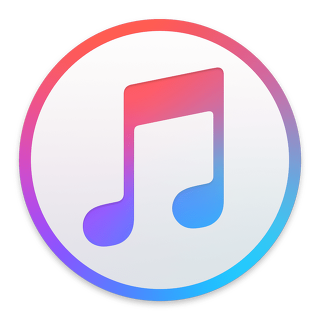

# iOS 클론 코딩 🔥
> 시작 : 21.05.10 ~   
> 종료 : ~ 21.06.24

| 날짜 | 진행상황 | 클론 주제 | 수행여부 |  리드미 이동 |  
| :----------: | :----------: | :----------: | :----------: | :----------: | 
| 5/10 ~ 5/20 | 중간 점검 | 애플뮤직 |  | [이동](./AppleMusic) |
| 5/20 ~ 5/27 | 최종 결과 | 애플뮤직 |  | [이동](./AppleMusic/readme/AppleMusic2.md) |
| 5/27 ~ 6/01 | 추가 뷰 구성 | 애플뮤직 |  | [이동](./AppleMusic/readme/AppleMusic3.md) |
| 5/27 ~ 6/10 | 중간 점검 | 인스타그램 |  | [이동](./Instagram/readme/Instagram1.md) |
| 6/10 ~ 6/17 | 최종 결과 | 인스타그램 |  | [이동](./Instagram/readme/Instagram2.md) |
| 6/17 ~ 6/24 | 못한 부분 완성 | 인스타그램 |  | [이동](./Instagram/readme/Instagram3.md) |
